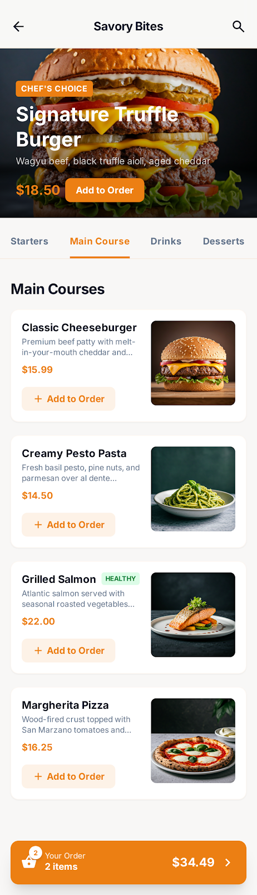
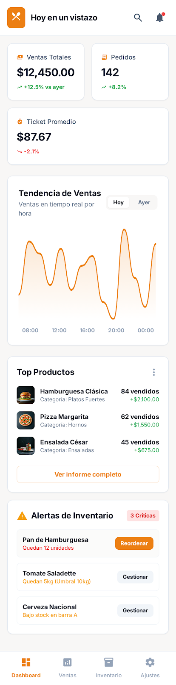
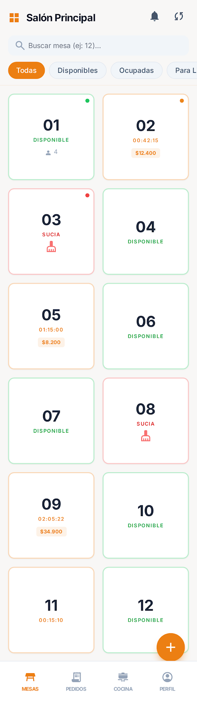

## Descripcion De Software

El proyecto consiste en el desarrollo de una aplicación de software diseñada para optimizar la gestión y atención en restaurantes. Esta herramienta busca solucionar problemas comunes en el servicio a mesa, mejorar la experiencia del cliente y facilitar la organización interna del establecimiento.

La aplicación permitirá a los clientes armar su pedido de manera personalizada, eligiendo los productos, ingredientes o combinaciones según sus preferencias. Esto no solo mejora la experiencia del usuario, sino que también reduce errores en la toma de pedidos.

Por otro lado, el sistema ayudará al personal del restaurante a gestionar de forma eficiente las mesas, visualizando cuáles están ocupadas, disponibles o en proceso de atención. Además, permitirá organizar los pedidos de manera clara, agilizando la comunicación entre los meseros y la cocina.

En general, esta aplicación busca mejorar la calidad del servicio, reducir tiempos de espera y optimizar la administración del restaurante mediante una solución tecnológica intuitiva y eficiente.

  